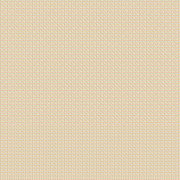

# UI Components

A personal collection of reusable React components and effects. Things I have been inspired by and built into flexible, drop-in pieces I can bring to any project.

I will update this README as each new component is added.

---

## Components

### Neumorphic Shadow



A soft-UI surface that derives its own light and dark shadow colors from a single background hex. On mount it plays a subtle press-in entry animation, then settles into a resting inset state. Built with [Motion](https://motion.dev).

#### Props

| Prop | Type | Default | Description |
|------|------|---------|-------------|
| `as` | `React.ElementType` | `"div"` | The HTML element or component to render as |
| `bg` | `string` | `"#e8d9c0"` | Background hex color, used to derive the light and dark shadow tones |
| `entry` | `boolean` | `true` | Whether to play the mount animation |
| `delay` | `number` | `0` | Delay in seconds before the entry animation starts |
| `...rest` | | | All other props are forwarded to the underlying element (e.g. `className`, `style`, `onClick`) |

#### Usage

```tsx
import NeuShadow from "./NeuShadow";

<NeuShadow className="w-16 h-16 rounded-xl" bg="#e8d9c0" />

// As a button, with a delay
<NeuShadow as="button" bg="#dce3ea" delay={0.2} className="px-6 py-3 rounded-full">
  Click me
</NeuShadow>
```
